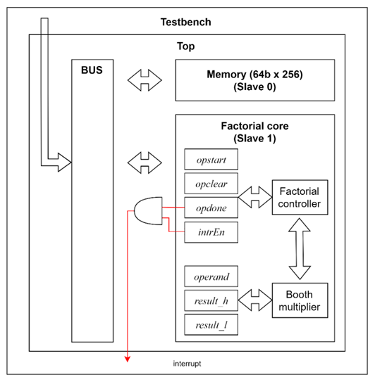
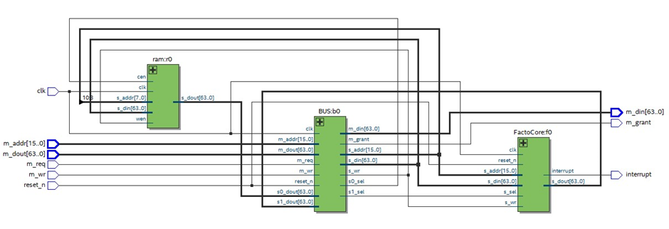

# Factorial_computation_system

## Introduction
프로젝트의 주제는 “Factorial computation system”으로 이 시스템은 factorial 연산을 사용자가 원하는 대로 수행한다. 
본 시스템은 Factorial core, BUS, Memory로 구성되고 testbench를 이용하여 시스템의 동작을 제어한다. 
Factorial core는 BUS를 통해 접근할 수 있는 register 집합 (opstart, opclear, opdone, intrEn, operand, result_h, result_l)을 가지고 있다. 
Factorial core는 이 register 집합을 통해 외부 모듈과 데이터를 주고받을 수 있다. 
본 시스템이 시작하면 testbench는 BUS를 통해 Factorial core에 접근하여 register read/write를 수행한다. 
예를 들어 연산을 시작하기 위해서는 testbench가 operand에 피연산자를, opstart[0]에 1을 순서대로 write해야 한다. 
만약 testbench가 interrupt 사용을 원하면 opstart[0]에 1을 write하기 전 intrEn[0]에 1 을 write 해야 한다. 
연산 종료 후에는 opclear[0]에 1을 write 하여 Factorial core를 초기화한다.

## Block Diagram

## RTL viewer

## Module
- Factorial core  
: 주어진 operand의 값에 대해 factorial 연산을 수행한다.
- BUS  
: 여러 component 들 간에 data 를 전송(transfer)할 수 있도록 연결해주는 component이다.
- Memory(RAM)  
: 임의의 address에 대해 data를 읽고 쓴다.
- Top  
: BUS, Factorial core와 Memory를 instance하여 연결한 모듈이다. Top 모듈의 input port를 이용해 Top 모듈 내에 있는 BUS 의 master port 에 접근이 가능하다.memory mapped I/O 
방식을 사용하여 외부(testbench)에서 주소를 통해 Top 모듈의 slave (Factorial core, Memory) device 에 접근이 가능하다. 또한 내부의 Factorial core에 직결된 interrupt 를 통해 core의 
동작 상태를 testbench에 전달할 수 있다. 
